# 第一章：数组的概念

## 1.1 为什么需要数组？

### 1.1.1 需求分析 1

* 需要统计某公司 50 个员工的工资情况，例如：计算平均工资、最高工资等。如果使用之前的知识，我们需要声明 50 个变量来分别记录每位员工的工资，即：

```c
#include <stdio.h>

int main(){
    
    double num1 = 0;
    double num2 = 0;
    double num3 = 0;
    ...
    printf("请输入第 1 个员工的工资：");
    scanf("%lf",&num1);
    printf("请输入第 2 个员工的工资：");
    scanf("%lf",&num2);
    printf("请输入第 3 个员工的工资：");
    scanf("%lf",&num3);
    ...   
    return 0;
}
```

* 这样会感觉特别机械和麻烦（全是复制（Ctrl + c）和粘贴（Ctrl + v），CV 大法）；此时，我们就可以将所有的`数据`全部存储到一个`容器（数组）`中进行统一管理，并进行其它的操作，如：求最值、求平均值等，如下所示：

```c
#include <stdio.h>

int main(){
    // 声明数组
    double nums[50];
    // 数组的长度
    int length = sizeof(nums) / sizeof(double);
    // 使用 for 循环向数组中添加值
    for(int i = 0;i < length;i++){
        printf("请输入第 &d 个员工的工资：",i);
        scanf("%lf",&num[i]);
    }
    // 其它操作，如：求最值，求平均值等
    ...        
    return 0;
}
```

### 1.1.2 需求分析 2

* 在现实生活中，我们会使用很多 APP 或微信小程序等，即：


* 同样的道理，如果我们使用变量来存储每个商品信息，那么就需要非常多的变量；但是，如果我们将这些`商品信息`都存储到一个`容器（数组）`中，进行统一管理；那么，之后的数据处理将会非常方便。

### 1.1.3 容器的概念

* `生活中的容器`：水杯（装水、饮料的容器）、衣柜（装衣服等物品的容器）、集装箱（装货物等物品的容器）。
* `程序中的容器`：将多个数据存储到一起，并且每个数据称为该容器中的元素。

## 1.2 什么是数组？

* 数组（Array）是将多个`相同数据类型`的`数据`按照一定的顺序排序的`集合`，并使用一个`标识符`命名，以及通过`编号（索引，亦称为下标）`的方式对这些数据进行统一管理。

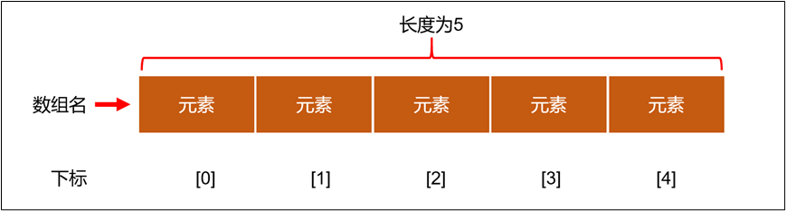

## 1.3 数组的相关概念

* `数组名`：本质上是一个标识符常量，命名需要符合标识符规则和规范。
* `元素`：同一个数组中的元素必须是相同的数据类型。
* `索引（下标）`：从 0 开始的连续数字。
* `数组的长度`：就是元素的个数。

## 1.4 数组的特点

* ① 创建数组的时候，会在内存中开辟一整块`连续的空间`，占据空间的大小，取决于数组的长度和数组中元素的类型。
* ② 数组中的元素在内存中是依次紧密排列且有序的。
* ③ 数组一旦初始化完成，且长度就确定的，并且`数组的长度一旦确定，就不能更改`。
* ④ 我们可以直接通过索引（下标）来获取指定位置的元素，速度很快。
* ⑤ 数组名中引用的是这块连续空间的首地址。


# 第二章：数组的操作（⭐）

## 2.1 数组的定义

### 2.1.1 动态初始化

* 语法：

```c
数据类型 数组名[元素个数|长度];
```

> [!NOTE]
>
> * ① 数据类型：表示的是数组中每一个元素的数据类型。
> * ② 数组名：必须符合标识符规则和规范。
> * ③ 元素个数或长度：表示的是数组中最多可以容纳多少个元素（不能是负数、也不能是 0 ）。


* 示例：

```c
#include <stdio.h>

int main() {

    // 先指定元素的个数和类型，再进行初始化

    // 定义数组
    int arr[3];

    // 给数组元素赋值
    arr[0] = 10;
    arr[1] = 20;
    arr[2] = 30;

    return 0;
}
```

### 2.1.2 静态初始化 1

* 语法：

```c
数据类型 数组名[元素个数|长度] = {元素1,元素2,...} 
```

> [!NOTE]
>
> * ① 静态部分初始化：如果数组初始化的元素个数`小于`数组声明的长度，那么就会从数组开始位置依次赋值，不够的就补 0 。
> * ② 静态全部初始化：数组初始化的元素个数`等于`数组的长度。

* 技巧：

  * 在 CLion 中可以开启`聚合初始化`功能，即：

  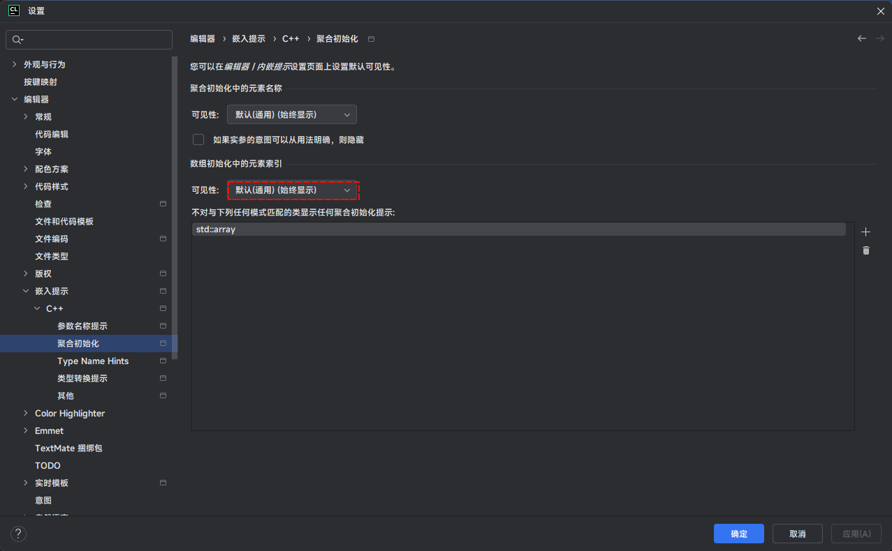

  * 这样，在 CLion 中，将会显示数组初始化中的元素索引，即：

  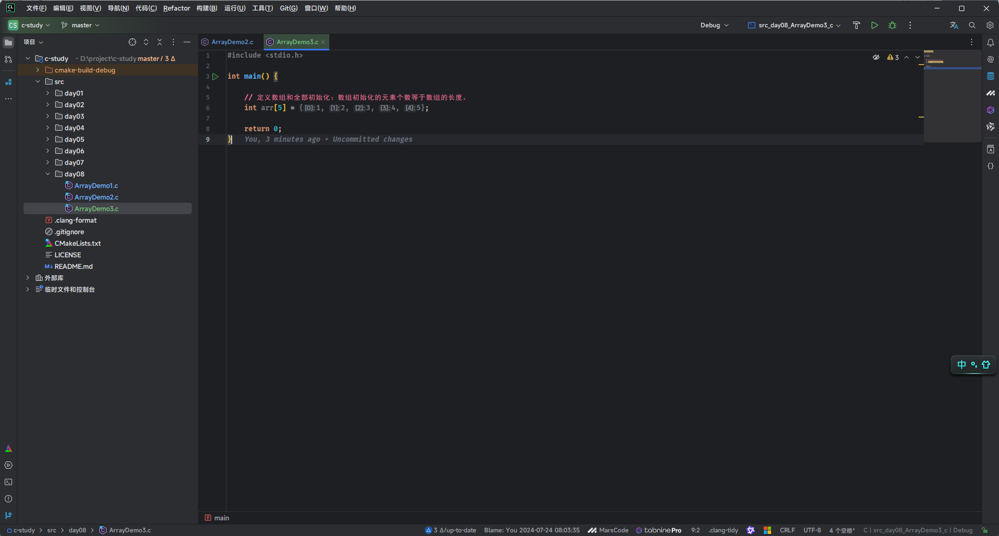


* 示例：静态部分初识化

```c
#include <stdio.h>

int main() {

    // 定义数组和部分初始化：
    // 会将给定的值从数组的开始位置一个个的赋值，没有赋值的地方，用 0 填充
    int arr[5] = {1, 2};

    return 0;
}
```


* 示例：静态全部初始化

```c
#include <stdio.h>

int main() {

    // 定义数组和全部初始化：数组初始化的元素个数等于数组的长度。
    int arr[5] = {1, 2, 3, 4, 5};

    return 0;
}
```

### 2.1.3 静态初始化 2 

* 语法：

```c
数据类型 数组名[] = {元素1,元素2,...} 
```

> [!NOTE]
>
> 没有给出数组中元素的个数，将由系统根据初始化的元素，自动推断出数组中元素的个数。


* 示例：

```c
#include <stdio.h>

int main() {

    // 指定元素的类型，不指定元素个数，同时进行初始化
    int arr[] = {1, 2, 3, 4, 5};

    return 0;
}
```

## 2.2 访问数组元素

* 语法：

```c
数组名[索引|下标];
```

> [!NOTE]
>
> 假设数组 `arr` 有 n 个元素，如果使用的数组的下标 `< 0` 或 `> n-1` ，那么将会产生数组越界访问，即超出了数组合法空间的访问；那么，数组的索引范围是 `[0,arr.length - 1]`。


* 示例：

```c
#include <stdio.h>

int main() {

    // 先指定元素的个数和类型，再进行初始化

    // 定义数组
    int arr[3];

    // 给数组元素赋值
    arr[0] = 10;
    arr[1] = 20;
    arr[2] = 30;

    // 访问数组元素
    printf("arr[0] = %d\n", arr[0]); // arr[0] = 10
    printf("arr[1] = %d\n", arr[1]); // arr[1] = 20
    printf("arr[2] = %d\n", arr[2]); // arr[2] = 30

    return 0;
}
```


* 示例：

```c
#include <stdio.h>

int main() {

    // 定义数组和部分初始化：
    // 会将给定的值从数组的开始位置一个个的赋值，没有赋值的地方，用 0 填充
    int arr[5] = {1, 2};

    // 访问数组元素
    printf("arr[0] = %d\n", arr[0]); // arr[0] = 1
    printf("arr[1] = %d\n", arr[1]); // arr[1] = 2
    printf("arr[2] = %d\n", arr[2]); // arr[2] = 0
    printf("arr[3] = %d\n", arr[3]); // arr[3] = 0
    printf("arr[4] = %d\n", arr[4]); // arr[4] = 0

    return 0;
}
```


* 示例：

```c
#include <stdio.h>

int main() {

    // 指定元素的类型，不指定元素个数，同时进行初始化
    int arr[] = {1, 2, 3, 4, 5};

    // 访问数组元素
    printf("arr[0] = %d\n", arr[0]); // arr[0] = 1
    printf("arr[1] = %d\n", arr[1]); // arr[1] = 2
    printf("arr[2] = %d\n", arr[2]); // arr[2] = 3
    printf("arr[3] = %d\n", arr[3]); // arr[3] = 4
    printf("arr[4] = %d\n", arr[4]); // arr[4] = 5

    return 0;
}
```


* 示例：

```c
#include <stdio.h>

int main() {

    // 定义数组和全部初始化：数组初始化的元素个数等于数组的长度。
    int arr[5] = {1, 2, 3, 4, 5};

    // 访问数组元素
    printf("arr[0] = %d\n", arr[0]); // arr[0] = 1
    printf("arr[1] = %d\n", arr[1]); // arr[1] = 2
    printf("arr[2] = %d\n", arr[2]); // arr[2] = 3
    printf("arr[3] = %d\n", arr[3]); // arr[3] = 4
    printf("arr[4] = %d\n", arr[4]); // arr[4] = 5

    return 0;
}
```

## 2.3 数组越界

* 数组下标必须在指定范围内使用，超出范围视为越界。

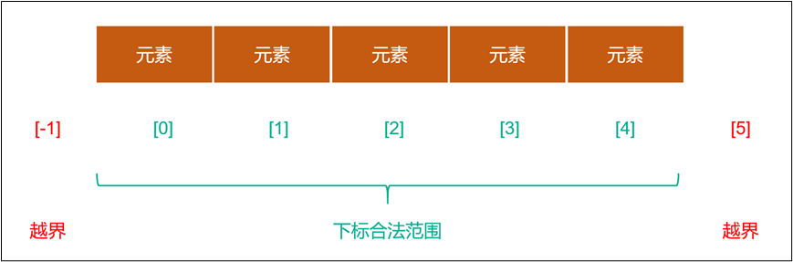

> [!NOTE]
>
> * ① C 语言是不会做数组下标越界的检查，并且编译器也不会报错；但是，编译器不报错，并不意味着程序就是正确！
> * ② 在其它高级编程语言，如：Java、JavaScript、Rust 等中，如果数组越界访问，编译器是会直接报错的！！！


* 示例：

```c
#include <stdio.h>

int main() {

    // 定义数组和全部初始化：数组初始化的元素个数等于数组的长度。
    int arr[] = {1, 2, 3, 4, 5};

    // 访问数组元素
    printf("arr[0] = %d\n", arr[0]); // arr[0] = 1
    printf("arr[1] = %d\n", arr[1]); // arr[1] = 2
    printf("arr[2] = %d\n", arr[2]); // arr[2] = 3
    printf("arr[3] = %d\n", arr[3]); // arr[3] = 4
    printf("arr[4] = %d\n", arr[4]); // arr[4] = 5
    printf("arr[-1] = %d\n", arr[-1]); // 得到的是不确定的结果
    printf("arr[5] = %d\n", arr[5]); // 得到的是不确定的结果

    return 0;
}
```

## 2.4 计算数组的长度

* 数组长度（元素个数）是在数组定义的时候明确指定且固定的，我们不能在运行的时候直接获取数组长度；但是，我们可以通过 sizeof 运算符间接计算出数组的长度。
* 计算步骤，如下所示：
  * ① 使用 sizeof 运算符计算出整个数组的字节长度。
  * ② 由于数组成员是同一数据类型；那么，每个元素的字节长度一定相等，那么`数组的长度 = 整个数组的字节长度 ÷ 单个元素的字节长度 `。

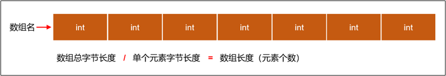

> [!NOTE]
>
> * ① 在很多编程语言中，都内置了获取数组的长度的属性或方法，如：Java 中的 arr.length 或 Rust 的 arr.len()。
> * ② 但是，C 语言没有内置的获取数组长度的属性或方法，只能通过 sizeof 运算符间接来计算得到。
> * ③ 数组一旦`声明`或`定义`，其`长度`就`固定`了，`不能动态变化`。


* 示例：

```c
#include <stdio.h>

int main() {

    // 定义数组和全部初始化：数组初始化的元素个数等于数组的长度。
    int arr[] = {1, 2, 3, 4, 5};

    // 计算数组的长度
    size_t length = sizeof(arr) / sizeof(arr[0]);

    // 遍历数组
    for (int i = 0; i < length; i++) {
        printf("%d \n", arr[i]);
    }

    return 0;
}
```

## 2.5 遍历数组

* 遍历数组是指按顺序访问数组中的每个元素，以便读取或修改它们，编程中一般使用循环结构对数组进行遍历。


* 示例：声明一个存储有 12、2、31、24、15、36、67、108、29、51 的数组，并遍历数组所有元素

```c
#include <stdio.h>

int main() {

    // 定义数组并初始化
    int arr[] = {12, 2, 31, 24, 15, 36, 67, 108, 29, 51};

    // 计算数组的长度
    size_t length = sizeof(arr) / sizeof(int);

    // 遍历数组
    for (int i = 0; i < length; i++) {
        printf("%d\n", arr[i]);
    }

    return 0;
}
```


* 示例：声明长度为 10 的 int 类型数组，给数组元素依次赋值为 0 ~ 9 ，并遍历数组所有元素

```c
#include <stdio.h>

int main() {

    // 定义数组
    int arr[10];

    // 计算数组的长度
    size_t length = sizeof(arr) / sizeof(int);

    // 给数组的每个元素赋值
    for (int i = 0; i < length; i++) {
        arr[i] = i;
    }

    // 遍历数组
    for (int i = 0; i < length; i++) {
        printf("%d\n", arr[i]);
    }

    return 0;
}
```

## 2.6 一维数组的内存分析

### 2.6.1 数组内存图

* 假设数组是如下的定义：

```c
int arr[] = {1,2,3,4,5};
```

* 那么，对应的内存结构，如下所示：

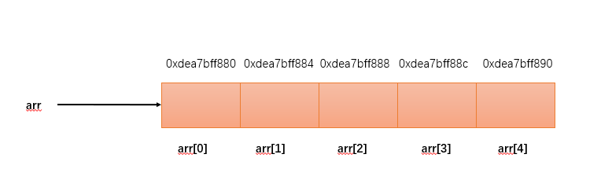

> [!NOTE]
>
> * ① 数组名 `arr` 就是记录该数组的首地址，即 `arr[0]` 的地址。
> * ② 数组中的各个元素是连续分布的，假设 `arr[0]` 的地址是 `0xdea7bff880`，则 `arr[1] 的地址 =  arr[0] 的地址 + int 字节数（4） = 0xdea7bff880 + 4 = 0xdea7bff884` ，依次类推...

* 在 C 语言中，我们可以通过 `&arr` 或 `&arr[0]` 等形式获取数组或数组元素的地址，即：

```c
#include <stdio.h>

int main() {

    // 定义数组
    int arr[10];

    // 计算数组的长度
    size_t length = sizeof(arr) / sizeof(int);

    // 给数组的每个元素赋值
    for (int i = 0; i < length; i++) {
        arr[i] = i;
    }

    printf("数组的地址是 = %p\n", arr);

    // 遍历数组
    for (int i = 0; i < length; i++) {
        printf("数组元素 %d 的地址是 = %p\n", arr[i], &arr[i]);
    }

    return 0;
}
```

### 2.6.2 数组的注意事项

* `C 语言规定，数组一旦声明，数组名指向的地址将不可更改`。因为在声明数组的时候，编译器会自动会数组分配内存地址，这个地址和数组名是绑定的，不可更改。

> [!WARNING]
>
> 如果之后试图更改数组名对应的地址，编译器就会报错。


* 示例：错误演示

```c
int num[5]; // 声明数组
// 使用大括号重新赋值是不允许的，必须在数组声明的时候赋值，否则编译将会报错
num = {1,2,3,4,5} ; // 报错
```


* 示例：错误演示

```c
int num[] = {1,2,3,4,5};
// 使用大括号重新赋值是不允许的，必须在数组声明的时候赋值，否则编译将会报错
num = {2,3,4,5,6}; // 报错
```


* 示例：错误演示

```c
int num[5];

num = NULL; // 报错，需要和 Java 区别一下，在 C 中不可以
```


* 示例：错误演示

```c
int a[] = {1,2,3,4,5} 

int b[5] = a ; // 报错，需要和 Java 区别一下，在 C 中不可以
```

## 2.7 数组应用案例

### 2.7.1 应用示例

* 需求：计算数组中所有元素的和以及平均数。


* 示例：

```c
#include <stdio.h>

int main() {

    // 定义数组并初始化
    int arr[] = {12, 2, 31, 24, 15, 36, 67, 108, 29, 51};

    // 计算数组的长度
    size_t length = sizeof(arr) / sizeof(int);

    // 变量保存总和
    int sum = 0;

    // 遍历数组
    for (int i = 0; i < length; i++) {
        sum += arr[i];
    }

    double avg = (double)sum / length;
    printf("数组的和为：%d\n", sum); // 数组的和为：375
    printf("数组的平均值为：%.2lf\n", avg); //数组的平均值为：37.50

    return 0;
}
```

### 2.7.2 应用示例

* 需求：计算数组的最值（最大值和最小值）。

> [!NOTE]
>
> 思路：
>
> * ① 假设数组中的第一个元素是最大值或最小值，并使用变量 max 或 min 保存。
> * ② 遍历数组中的每个元素：
>   * 如果有元素比最大值还要大，就让变量 max 保存最大值。
>   * 如果有元素比最小值还要小，就让变量 min 保存最小值。


* 示例：

```c
#include <stdio.h>

int main() {

    // 定义数组并初始化
    int arr[] = {12, 2, 31, 24, 15, -36, 67, 108, 29, 51};

    // 计算数组的长度
    size_t length = sizeof(arr) / sizeof(int);

    // 定义最大值
    int max = arr[0];
    // 定义最小值
    int min = arr[0];

    // 遍历数组
    for (int i = 0; i < length; i++) {
        if (arr[i] >= max) {
            max = arr[i];
        }
        if (arr[i] <= min) {
            min = arr[i];
        }
    }

    printf("数组的最大值为：%d\n", max); // 数组的最大值为：108
    printf("数组的最小值为：%d\n", min); // 数组的最小值为：-36

    return 0;
}
```

### 2.7.3 应用示例

* 需求：统计数组中某个元素出现的次数，要求：使用无限循环，如果输入的数字是 0 ，就退出。


* 示例：

```c
#include <stdio.h>

int main() {

    // 定义数组并初始化
    int arr[] = {12, 2, 31, 24, 2, -36, 67, 108, 29, 51};

    // 计算数组的长度
    size_t length = sizeof(arr) / sizeof(int);

    // 遍历数组
    printf("当前数组中的元素是：");
    for (int i = 0; i < length; i++) {
        printf("%d ", arr[i]);
    }

    printf("\n");

    // 无限循环
    while (true) {
        // 统计的数字
        int num;
        // 统计数字出现的次数
        int count = 0;
        // 输入数字
        printf("请输入要统计的数字：");
        scanf("%d", &num);

        // 0 作为结束条件
        if (num == 0) {
            break;
        }

        // 遍历数组，并计数
        for (int i = 0; i < length; i++) {
            if (arr[i] == num) {
                count++;
            }
        }

        printf("您输入的数字 %d 在数组中出现了 %d 次\n", num, count);
    }

    return 0;
}
```

### 2.7.4 应用示例

* 需求：将数组 a 中的全部元素复制到数组 b 中。


* 示例：

```c
#include <stdio.h>

#define  SIZE 10

int main() {

    // 定义数组并初始化
    int a[] = {12, 2, 31, 24, 15, -36, 67, 108, 29, 51};
    int b[SIZE];

    // 复制数组
    for (int i = 0; i < SIZE; i++) {
        b[i] = a[i];
    }

    // 打印数组 b 中的全部元素
    for (int i = 0; i < SIZE; i++) {
        printf("%d ", b[i]);
    }

    return 0;
}
```

### 2.7.5 应用示例

* 需求：数组对称位置的元素互换。

> [!NOTE]
>
> 思路：假设数组一共有 10 个元素，那么：
>
> *  a[0] 和 a[9] 互换。
> * a[1] 和 a[8] 互换。
> * ...
> 
> 规律就是 `a[i] <--互换--> arr[arr.length -1 -i]`


* 示例：

```c
#include <stdio.h>

int main() {

    // 原始数组
    int arr[] = {12, 2, 31, 24, 15, -36, 67, 108, 29, 51};

    // 计算数组的长度
    size_t SIZE = sizeof(arr) / sizeof(arr[0]);
    
    // 打印原始数组中的全部元素
    printf("原始数组：");
    for (int i = 0; i < SIZE; i++) {
        printf("%d ", arr[i]);
    }
    printf("\n");

    // 交换数组
    for (int i = 0; i < SIZE / 2; i++) {
        int temp          = arr[i];
        arr[i]            = arr[SIZE - 1 - i];
        arr[SIZE - 1 - i] = temp;
    }

    // 打印交换后的数组
    printf("交换后数组：");
    for (int i = 0; i < SIZE; i++) {
        printf("%d ", arr[i]);
    }
    printf("\n");

    return 0;
}
```


* 示例：

```c
#include <stdio.h>

int main() {

    // 原始数组
    int arr[] = {12, 2, 31, 24, 15, -36, 67, 108, 29, 51};

    // 计算数组的长度
    size_t SIZE = sizeof(arr) / sizeof(arr[0]);

    // 打印原始数组中的全部元素
    printf("原始数组：");
    for (int i = 0; i < SIZE; i++) {
        printf("%d ", arr[i]);
    }
    printf("\n");

    // 交换数组
    for (int i = 0, j = SIZE - 1 - i; i < SIZE / 2; i++, j--) {
        int temp = arr[i];
        arr[i]   = arr[j];
        arr[j]   = temp;
    }

    // 打印交换后的数组
    printf("交换后数组：");
    for (int i = 0; i < SIZE; i++) {
        printf("%d ", arr[i]);
    }
    printf("\n");

    return 0;
}
```

### 2.7.6 应用示例

* 需求：将数组中的最大值移动到数组的最末尾。

> [!NOTE]
>
> 思路：从数组的下标 `0` 开始依次遍历到 `length - 1` ，如果 `i` 下标当前的值比 `i+1` 下标的值大，则交换；否则，就不交换。


* 示例：

```c
#include <stdio.h>

int main() {

    // 原始数组
    int arr[] = {12, 2, 31, -24, 15, -36, 67, 891, 29, 51};

    // 计算数组的长度
    size_t length = sizeof(arr) / sizeof(arr[0]);

    // 打印原始数组中的全部元素
    printf("原始数组：");
    for (int i = 0; i < length; i++) {
        printf("%d ", arr[i]);
    }
    printf("\n");

    // 移动最大值到数组的最后一个位置
    for (int i = 0; i < length - 1; i++) {
        if (arr[i] > arr[i + 1]) {
            int temp   = arr[i];
            arr[i]     = arr[i + 1];
            arr[i + 1] = temp;
        }
    }

    // 打印移动之后的数组
    printf("移动之后的数组：");
    for (int i = 0; i < length; i++) {
        printf("%d ", arr[i]);
    }
    printf("\n");

    return 0;
}
```

### 2.7.7 应用示例

* 需求：实现冒泡排序，即将数组的元素从小到大排列。

> [!NOTE]
>
> 思路：一层循环，能实现最大值移动到数组的最后；那么，二层循环（控制内部循环数组的长度）就能实现将数组的元素从小到大排序。


* 示例：

```c
#include <stdio.h>

int main() {

    // 原始数组
    int arr[] = {12, 2, 31, -24, 15, -36, 67, 891, 29, 51};

    // 计算数组的长度
    size_t length = sizeof(arr) / sizeof(arr[0]);

    // 打印原始数组中的全部元素
    printf("原始数组：");
    for (int i = 0; i < length; i++) {
        printf("%d ", arr[i]);
    }
    printf("\n");

    for (int j = 0; j < length - 1; j++) {
        for (int i = 0; i < length - 1 - j; i++) {
            if (arr[i] > arr[i + 1]) {
                int temp = arr[i];
                arr[i] = arr[i + 1];
                arr[i + 1] = temp;
            }
        }
    }

    // 打印移动之后的数组
    printf("移动之后的数组：");
    for (int i = 0; i < length; i++) {
        printf("%d ", arr[i]);
    }
    printf("\n");

    return 0;
}
```


# 第三章：多维数组（⭐）

## 3.1 概述

### 3.1.1 引入

* 我们在数学、物理和计算机科学等学科中学习过`一维坐标`、`二维坐标`以及`三维坐标`。

* 其中，`一维坐标`通常用于描述在线段或直线上的点的位置，主要应用有：

  * **数轴**：一维坐标可以用来表示数轴上的数值位置，这在基础数学和初等代数中非常常见。

  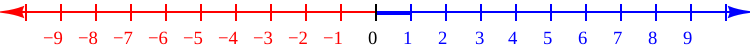

  * **时间轴**：时间可以看作是一维的，它可以用一维坐标表示，例如：秒、分钟、小时等。

  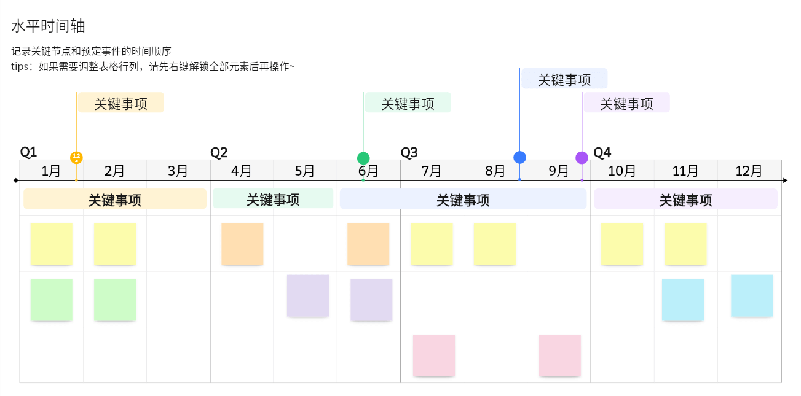

  * **统计数据**：一维坐标常用于表示单变量的数据集，如：测量身高、体重、温度等。

  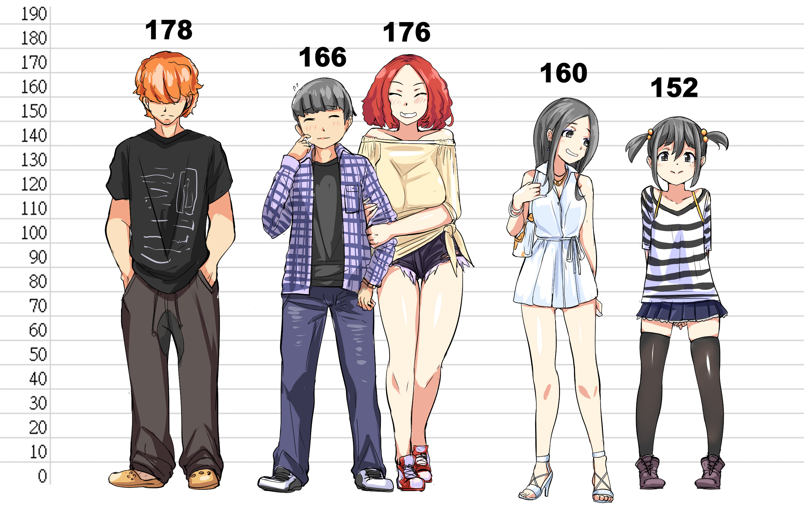

* 其中，`二维坐标`用于描述平面上的点的位置。主要应用包括：

  * **几何学**：在几何学中，二维坐标用于表示平面图形的顶点、边和面积等。

  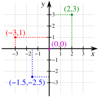

  * **地图和导航**：地理坐标系统（经纬度）使用二维坐标来表示地球表面的任意位置。

  

  * **图形设计和计算机图形学**：二维坐标在绘制图形、设计图案和用户界面中非常重要。

  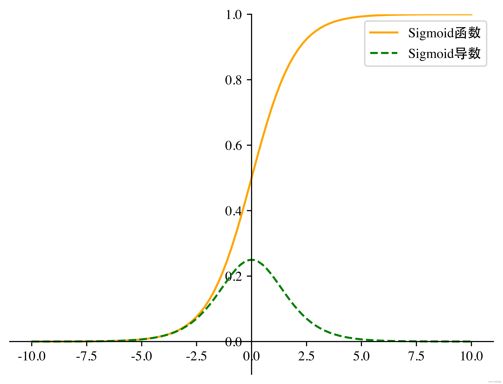

  * **物理学**：二维运动和场，例如：在描述物体在平面上的运动轨迹时使用二维坐标。

  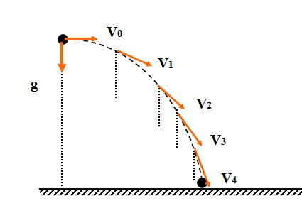

* 其中，三维坐标用于描述空间中点的位置。主要应用包括：

  * **几何学**：三维坐标在空间几何中用于表示立体图形的顶点、边、面和体积。

  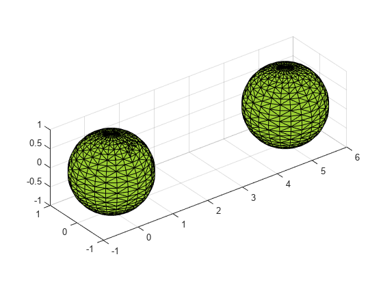

  * **计算机图形学**：三维建模和动画需要使用三维坐标来创建和操控虚拟对象。

  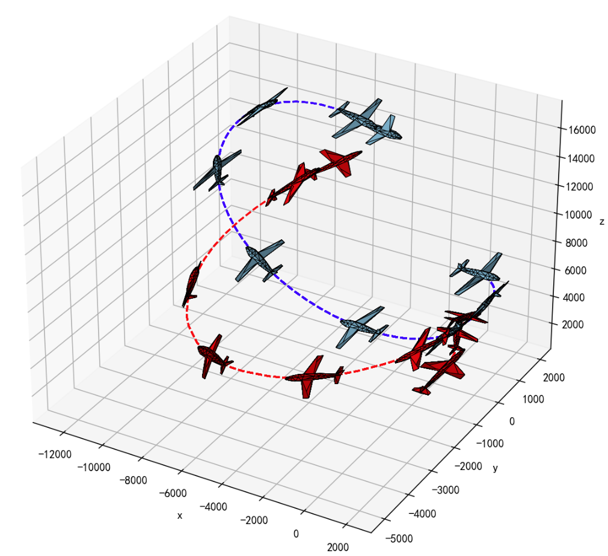

  * **工程和建筑设计**：在设计建筑物、机械部件和其他工程项目时，使用三维坐标来精确定位和规划。

  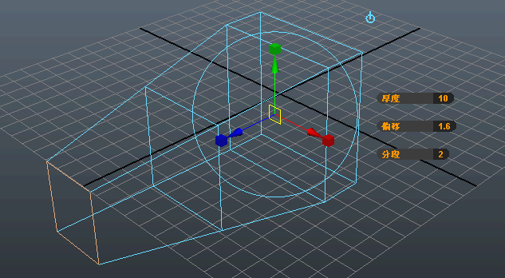

  * **物理学**：三维空间中的力、运动和场，例如：描述物体在空间中的位置和运动轨迹。

  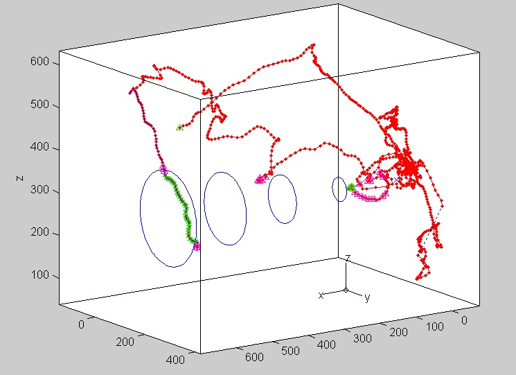

* 总而言之，一维、二维和三维坐标系统在不同的领域中各有其重要的应用，从基础数学到高级科学和工程技术，它们帮助我们更好地理解和描述世界的结构和行为。

### 3.1.2 多维数组

* 在 C 语言中，多维数组就是数组嵌套，即：在数组中包含数组，数组中的每一个元素还是一个数组类型，如下所示：

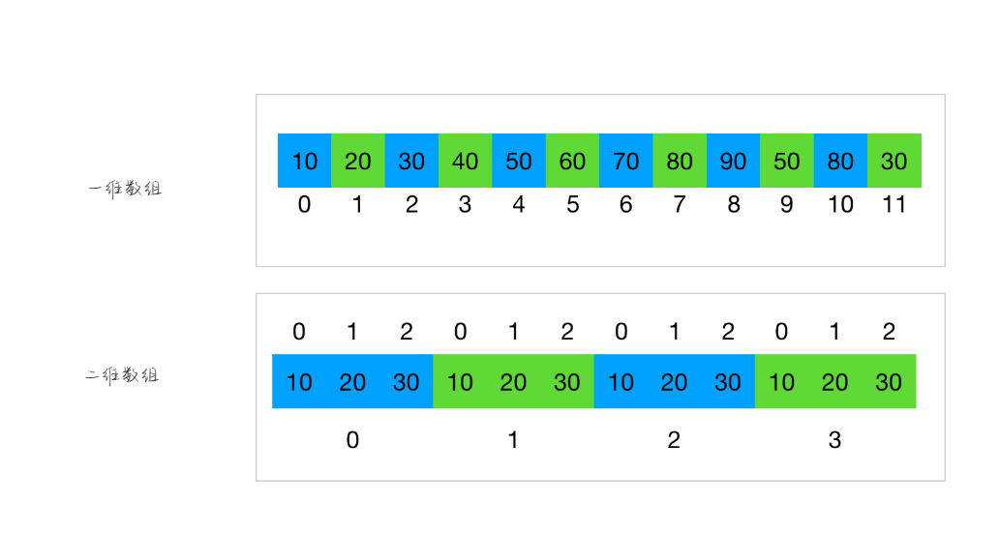

> [!NOTE]
>
> * ① 如果数组中嵌套的每一个元素是一个常量值，那么该数组就是一维数组。
> * ② 如果数组中嵌套的每一个元素是一个一维数组，那么该数组就是二维数组。
> * ③ 如果数组中前台的每一个元素是一个二维数组，那么该数组就是三维数组.
> * ④ 依次类推...


* 一维数组和多维数组的理解：
  * 从内存角度看：一维数组或多维数组都是占用的一整块连续的内存空间。
  * 从数据操作角度看：
    * 一维数组可以直接通过`下标`访问到数组中的某个元素，即：0、1、...
    * 二维数组要想访问某个元素，先要获取某个一维数组，然后在一维数组中获取对应的数据。

> [!NOTE]
>
> * ① C 语言中的一维数组或多维数组都是占用的一整块连续的内存空间，其它编程语言可不是这样的，如：Java 等。
> * ② 在实际开发中，最为常用的就是二维数组或三维数组了，以二维数组居多！！！

## 3.2 二维数组的定义

### 3.2.1 动态初始化

* 语法：

```c
数据类型 数组名[几个⼀维数组元素][每个⼀维数组中有几个具体的数据元素];
```

> [!NOTE]
>
> * ① 二维数组在实际开发中，最为常见的应用场景就是表格或矩阵了。
> * ② 几个一维数组元素 = 行数。
> * ③ 每个⼀维数组中有几个具体的数据元素 = 列数。


* 示例：

```c
#include <stdio.h>

int main() {

    // 定义二维数组并初始化
    int arr[3][4] = {{1, 2, 3, 4}, {5, 6, 7, 8}, {9, 10, 11, 12}};

    // 输出二维数组中的元素
    printf("%d ", arr[0][0]);
    printf("%d ", arr[0][1]);
    printf("%d ", arr[0][2]);
    printf("%d \n", arr[0][3]);
    printf("%d ", arr[1][0]);
    printf("%d ", arr[1][1]);
    printf("%d ", arr[1][2]);
    printf("%d \n", arr[1][3]);
    printf("%d ", arr[2][0]);
    printf("%d ", arr[2][1]);
    printf("%d ", arr[2][2]);
    printf("%d ", arr[2][3]);

    return 0;
}
```

### 3.2.2 静态初始化 1

* 语法：

```c
数据类型 数组名[行数][列数] = {{元素1,元素2,...},{元素3,...},...} 
```

> [!NOTE]
>
> * ① 行数 = 几个一维数组元素。
> * ② 列数 = 每个⼀维数组中有几个具体的数据元素。


* 示例：

```c
#include <stdio.h>

int main() {

    // 定义二维数组并初始化
    int arr[3][4] = {{1, 2, 3, 4}, {5, 6, 7, 8}, {9, 10, 11, 12}};

    // 输出二维数组中的元素
    printf("%d ", arr[0][0]);
    printf("%d ", arr[0][1]);
    printf("%d ", arr[0][2]);
    printf("%d \n", arr[0][3]);
    printf("%d ", arr[1][0]);
    printf("%d ", arr[1][1]);
    printf("%d ", arr[1][2]);
    printf("%d \n", arr[1][3]);
    printf("%d ", arr[2][0]);
    printf("%d ", arr[2][1]);
    printf("%d ", arr[2][2]);
    printf("%d ", arr[2][3]);

    return 0;
}
```

### 3.2.3 静态初始化 2

* 语法：

```c
数据类型 数组名[][列数] = {{元素1,元素2,...},{元素3,...},...} 
```

> [!NOTE]
>
> * ① 列数 = 每个⼀维数组中有几个具体的数据元素。
> * ② 可以不指定行数，必须指定列数，编译器会根据元素的个数和列的个数，自动推断出行数！！！


* 示例：

```c
#include <stdio.h>

int main() {

    // 定义二维数组
    int arr[][4] = {{1, 2, 3, 4}, {5, 6}, {9, 10, 11, 12}};

    // 输出二维数组中的元素
    printf("%d ", arr[0][0]);
    printf("%d ", arr[0][1]);
    printf("%d ", arr[0][2]);
    printf("%d \n", arr[0][3]);
    printf("%d ", arr[1][0]);
    printf("%d \n", arr[1][1]);
    printf("%d ", arr[2][0]);
    printf("%d ", arr[2][1]);
    printf("%d ", arr[2][2]);
    printf("%d ", arr[2][3]);

    return 0;
}
```

## 3.3 二维数组的理解

* 如果二维数组是这么定义的，即：

```c
int arr[3][4];
```

* 那么，这个二维数组 `arr` 可以看做是 `3` 个一维数组组成，它们分别是 `arr[0]`、`arr[1]`、`arr[2]`。这 `3` 个一维数组都各有 4 个元素，如：一维数组 `arr[0]` 中的元素是 `arr[0][0]`、`arr[0][1]`、`arr[0][2]`、`arr[0][3]`，即：

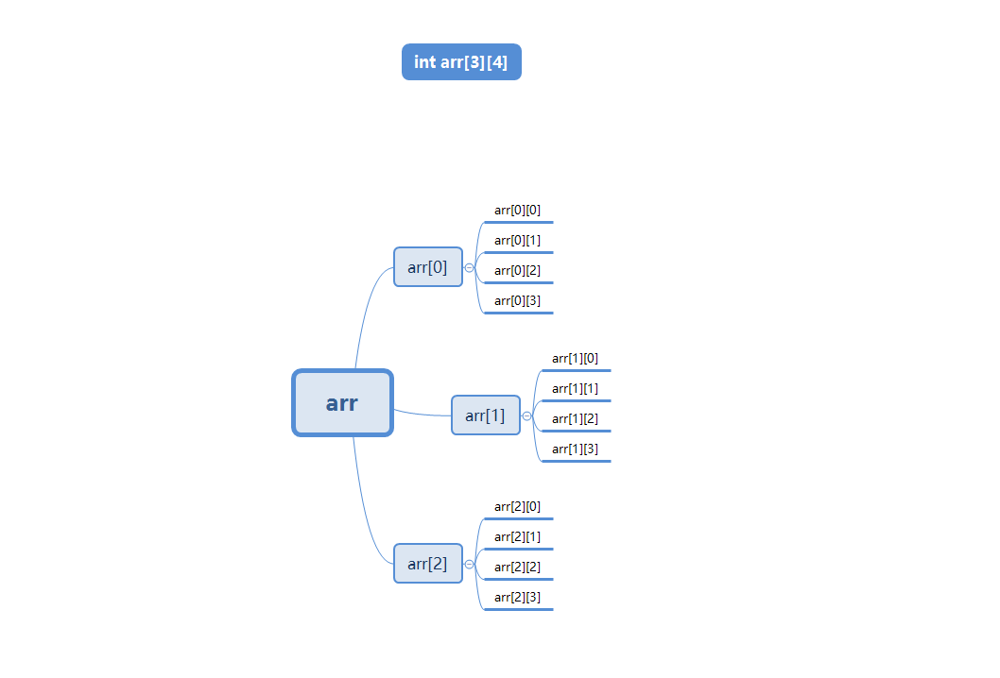

## 3.4 二维数组的遍历

* 访问二维数组的元素，需要使用两个下标（索引），一个用于访问行（第一维），另一个用于访问列（第二维），我们通常称为行下标（行索引）或列下标（列索引）。
* 所以，遍历二维数组，需要使用双层循环结构。

> [!NOTE]
>
> 如果一个二维数组是这么定义的，即：`int arr[3][4]`，那么：
>
> * `行的长度 = sizeof(arr) / sizeof(arr[0])` ，因为 `arr` 是二维数组的`总`的内存空间；而 `arr[0]` 、`arr[1]`、`arr[2]` 是二维数组中一维数组的内存空间 。
> * `列的长度 = sizeof(arr[0]) / sizeof(arr[0][0])`，因为`arr[0]` 、`arr[1]`、`arr[2]` 是二维数组中一维数组的内存空间 ，而 `arr[0][0]`、`arr[0][1]`、... 是一维数组中元素的内存空间。


* 示例：

```c
#include <stdio.h>

int main() {

    // 定义二维数组
    int arr[][4] = {{1, 2, 3, 4}, {5, 6}, {9, 10, 11, 12}};

    // 获取行列数
    int row = sizeof(arr) / sizeof(arr[0]);
    int col = sizeof(arr[0]) / sizeof(arr[0][0]);

    // 打印二维数组元素
    for (int i = 0; i < row; i++) {
        for (int j = 0; j < col; j++) {
            printf("%d ", arr[i][j]);
        }
        printf("\n");
    }

    return 0;
}
```

## 3.5 二维数组的内存分析

* 用`矩阵形式`（如：3 行 4 列形式）表示二维数组，是`逻辑`上的概念，能形象地表示出行列关系。而在`内存`中，各元素是连续存放的，不是二维的，是`线性`的。

* C 语言中，二维数组中元素排列的顺序是`按行存放`的。即：先顺序存放第一行的元素，再存放第二行的元素。例如：数组`a[3][4] `在内存中的存放，如下所示：

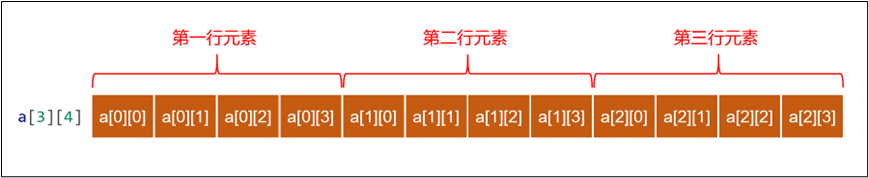

## 3.6 二维数组的应用案例

* 需求：现在有三个班，每个班五名同学，用二维数组保存他们的成绩，并求出每个班级平均分、以及所有班级平均分，数据要求从控制台输入。


* 示例：

```c
#include <stdio.h>

int main() {

    // 定义二维数组，用于保存成绩
    double arr[3][5];

    // 获取二维数组的行数和列数
    int row = sizeof(arr) / sizeof(arr[0]);
    int col = sizeof(arr[0]) / sizeof(arr[0][0]);

    // 从控制台输入成绩
    for (int i = 0; i < row; i++) {
        for (int j = 0; j < col; j++) {
            printf("请输入第%d个班级的第%d个学生的成绩：", i + 1, j + 1);
            scanf("%lf", &arr[i][j]);
        }
    }

    // 总分
    double totalSum = 0;

    // 遍历数组，求总分和各个班级的平均分
    for (int i = 0; i < row; i++) {
        double sum = 0;
        for (int j = 0; j < col; j++) {
            totalSum += arr[i][j];
            sum += arr[i][j];
        }
        printf("第%d个班级的总分为：%.2lf\n", i + 1, sum);
        printf("第%d个班级的平均分为：%.2lf\n", i + 1, sum / col);
    }

    printf("所有班级的总分为：%.2lf\n", totalSum);
    printf("所有班级的平均分为：%.2lf\n", totalSum / (row * col));

    return 0;
}
```

