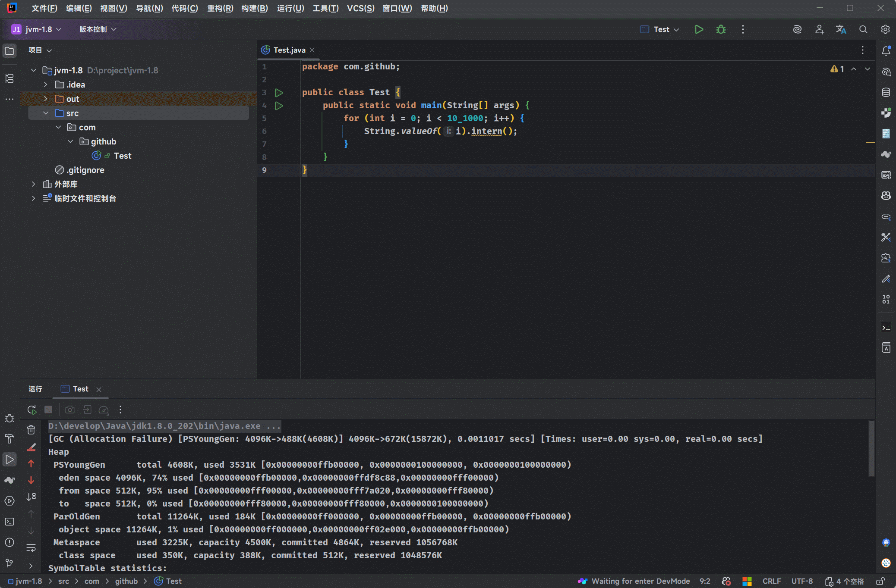

# 第一章：String Table

## 1.1 String 的基本特性

### 1.1.1 字符串常量池（String Pool）

* ① 字面量方式创建的字符串（`"hello"`）会被存储在`字符串常量池` 中（位于堆内存中的特殊区域）。

> [!NOTE]
>
> 字符串常量池中不会存储相同内容的字符串，如下所示：
>
> * String 的字符串常量池（String Pool）是一个固定大小的 Hashtable，默认值大小长度是 1009 。如果放进 String Pool 的 String 非常多，就会造成 Hash 冲突严重，从而导致链表会很长，而链表长了后造成的直接影响就是当调用 String.intern() 时性能会大幅度下降。
> * 使用 `-XX:StringTableSize` 可以设置 StringTable 的长度。
> * 在 JDK6 中的 StringTable 是固定的，就是 1009 的长度；所以，如果字符串常量池（String Pool）中的字符串过多就会导致性能下降很快，并且 StringTableSize 参数设置没有要求。
> * 在 JDK7 中的 StringTable 的长度默认值是 60013，并且 StringTableSize 参数设置没有要求。
> * 在 JDK8 中的 StringTable 的长度默认值是 60013，并且 StringTableSize 参数设置中 1009 是最小值。 

* ② 如果常量池中已存在相同内容的字符串，则直接复用，避免重复创建。
* ③ 使用 `new String("...")` 会强制在堆中创建新对象，即使内容相同。

> [!NOTE]
>
>  `==` 比较引用， `.equals()` 比较内容。 


* 示例：

```java
package com.github;
public class Test {
    public static void main(String[] args) {
        
        String a = "hello";
        String b = "hello";
        System.out.println(a == b); // true（引用相同）
        
    }
}
```


* 示例：

```java
package com.github;
public class Test {
    public static void main(String[] args) {
        
        String c = new String("hello");
        String d = new String("hello");
        System.out.println(c == d); // false（堆中不同对象）
        
    }
}
```

### 1.1.2 不可变性（Immutability）

* ① 一旦创建，`String` 对象的内容就无法被修改。
* ② 所有看似“修改”字符串的方法（ `substring()`、`concat()`、`replace()` 等）实际上都会返回一个新的 `String` 对象，而原对象保持不变。
* ③ 不可变性带来了线程安全、缓存哈希值、字符串池优化等优势。


* 示例：

```java
package com.github;
public class Test {
    public static void main(String[] args) {
        
        String s1 = "hello";
        String s2 = s1.concat(" world"); // 创建新对象
        System.out.println(s1 == s2); // false
        System.out.println(s1); // 输出: hello（未变）
        
    }
}
```

### 1.1.3 final 类

* ① `String` 类被声明为 `final`，不能被继承。
* ② 其内部的字符数组 `value`（在 Java 8 及之前是 `char[]`，Java 9+ 改为 `byte[]` + 编码标识）也是 `final` 的，确保内容不可变。

> [!NOTE]
>
> - Java 9 引入了 `Compact Strings` 优化：
>   - 若字符串仅包含 Latin-1 字符（0~255），使用 `byte[]` 存储，每个字符占 1 字节。
>   - 否则使用 UTF-16 编码（每个字符占 2 字节）。
> - 减少了内存占用，提升性能。

* ③ `String` 实现了 `CharSequence` 接口，因此可以与 `StringBuilder`、`StringBuffer` 等统一处理。


* 示例：

```java
public final class String // [!code highlight]
    implements java.io.Serializable, Comparable<String>, CharSequence { // [!code highlight]
    
    private final char value[]; // [!code highlight]
    
    ...
        
}
```

### 1.1.4 重写了 Object 的关键方法

* ① `equals(Object obj)`：按内容比较字符串是否相等。
* ② `hashCode()`：基于字符串内容计算哈希值，用于哈希表，如： `HashMap`。
* ③ `toString()`：返回字符串本身。


* 示例：

```java
package com.github;
public class Test {
    public static void main(String[] args) {
        
        String s1 = new String("abc");
        String s2 = new String("abc");
        System.out.println(s1.equals(s2)); // true（内容相同）
        
    }
}
```

## 1.2 String 的内存分配

### 1.2.1 概述

* 在 Java 语言中有 8 种基本数据类型和 String 类型（特殊的引用数据类型） 。这些类型为了使它们在运行过程中速度更快、更节省内存，都提供了一种`常量池`的概念。
* `常量池`就类似于 Java 系统级别提供的缓存；8 种基本数据类型的常量池都是系统协调的，而 `String 类型的常量池就比较特殊`。
* 对于 String 类型的常量池，主要有两种使用方法，如下所示：
  * ① 直接使用双引号声明出来的 String 对象会直接存储在常量池中，即：字面量声明的方式。
  * ② 如果不是双引号声明出来的 String 对象，可以使用 String 提供的 intern() 方法，让其存储到常量池中。

### 1.2.2 字符串常量池的迁移

* 在 JDK6 之前，`字符串常量池`是存放在`永久代`中。


* 在 JDK7 中，Hotspot 将`字符串常量池`的位置由方法区（永久代）迁移到了`堆`中。


* 在 JDK8 ，永久代被元空间取代；但是，`字符串常量池`还是在`堆`中。


### 1.2.3 验证

* 需求：不断的向字符串常量池中添加字符串，看报错信息，以观察字符串常量池的位置。

> [!NOTE]
>
> ::: details 点我查看 准备代码
>
> ```java
> package com.github;
> 
> import java.util.ArrayList;
> import java.util.List;
> 
> public class Test {
>     public static void main(String[] args) {
>         List<String> list = new ArrayList<String>();
> 
>         int i = 0;
>         while (true){
>             list.add(String.valueOf(i++).intern());
>         }
>     }
> }
> ```
>
> :::


* 示例：JDK6

::: code-group

```bash
-XX:PermSize=6m -XX:MaxPermSize=6m -Xms6m -Xmx6m 
```

```md:img [cmd 控制台]

```

:::


* 示例：JDK8

::: code-group

```bash
-XX:MetaspaceSize=32m -XX:MaxMetaspaceSize=32m -Xms6m -Xmx6m 
```

```md:img [cmd 控制台]

```

:::

## 1.3 String 的基本操作

* Java 语言规范中要求完全相同的字符串字面量，应该包含同样的 Unicode 字符序列（包含同一份码点序列的常量），并且必须是指向同一个 String 类实例。


* 示例：

::: code-group

```java [Test.java]
package com.github;

public class Test {
    public static void main(String[] args) {
        System.out.println("1"); // 2109
        System.out.println("2"); // 2111
        System.out.println("3");
        System.out.println("4");
        System.out.println("5");
        System.out.println("6");
        System.out.println("7");
        System.out.println("8");
        System.out.println("9");
        System.out.println("10"); // 2119

        System.out.println("1"); // 2120
        System.out.println("2"); // 2120
        System.out.println("3");
        System.out.println("4");
        System.out.println("5");
        System.out.println("6");
        System.out.println("7");
        System.out.println("8");
        System.out.println("9");
        System.out.println("10"); // 2120
    }
}
```

```md:img [cmd 控制台]

```

:::

## 1.4 字符串的拼接操作

### 1.4.1 概述

* ① 常量和常量的拼接结果在常量池中，原理是编译期优化。
* ② 常量池中不会存在相同内容的常量。
* ③ 只要其中有一个是变量，结果就在堆中，原理是 StringBuilder 。
* ④ 如果拼接的结果调用了 intern() 方法，则主动将常量池中还没有的字符串对象放入池中，并返回此对象地址。

### 1.4.2 应用示例

* 常量和常量的拼接结果在常量池中，原理是编译期优化。

> [!NOTE]
>
> 在编译期生成字节码的时候，就可以看出`常量和常量的拼接结果`在`常量池`中。


* 示例：

::: code-group

```java [Test.java]
package com.github;

public class Test {
    public static void main(String[] args) {
        String s1 = "a" + "b" + "c"; // 等同于 "abc"
        String s2 = "abc";
		
        System.out.println(s1 == s2); // true
        System.out.println(s1.equals(s2)); // true
    }
}
```

```txt [字节码指令]
 0 ldc #2 <abc>  // 从常量池中加载 "abc"
 2 astore_1
 3 ldc #2 <abc>  // 从常量池中加载 "abc"
 5 astore_2
 6 getstatic #3 <java/lang/System.out : Ljava/io/PrintStream;>
 9 aload_1
10 aload_2
11 if_acmpne 18 (+7)
14 iconst_1
15 goto 19 (+4)
18 iconst_0
19 invokevirtual #4 <java/io/PrintStream.println : (Z)V>
22 getstatic #3 <java/lang/System.out : Ljava/io/PrintStream;>
25 aload_1
26 aload_2
27 invokevirtual #5 <java/lang/String.equals : (Ljava/lang/Object;)Z>
30 invokevirtual #4 <java/io/PrintStream.println : (Z)V>
33 return
```

:::

### 1.4.3 应用示例

* 如果拼接符号的前后出现了变量，则相当于在堆空间中 new String()，具体的内容为拼接后的结果。

> [!NOTE]
>
> * ① 底层其实是 new StringBuilder().append(xx).append(xxx)....toString(); 
> * ② 字符串拼接操作底层不一定使用 StringBuilder，如果拼接符号左右两边是字符串常量或者使用 final 修饰的量，则依然是编译期优化，即：非 StringBuilder 的方式。


* 示例：

::: code-group

```java [Test.java]
package com.github;

public class Test {
    public static void main(String[] args) {
        String s1 = "java";
        String s2 = "EE";

        String s3 = "javaEE";
        String s4 = "java" + "EE"; // 编译期优化
        System.out.println(s3 == s4); // true

        String s5 = s1 + "EE";
        System.out.println(s3 == s5); // false

        String s6 = "java"+ s2;
        System.out.println(s3 == s6); // false

        String s7 = s1 + s2;
        System.out.println(s3 == s7); // false
    }
}
```

```txt [字节码指令]
  0 ldc #2 <java> // 从常量池中加载 "abc"
  2 astore_1
  3 ldc #3 <EE> // 从常量池中加载 "abc"
  5 astore_2
  6 ldc #4 <javaEE> // 从常量池中加载 "abc"
  8 astore_3
  9 ldc #4 <javaEE> // 从常量池中加载 "abc"
 11 astore 4
 13 getstatic #5 <java/lang/System.out : Ljava/io/PrintStream;>
 16 aload_3
 17 aload 4
 19 if_acmpne 26 (+7)
 22 iconst_1
 23 goto 27 (+4)
 26 iconst_0
 27 invokevirtual #6 <java/io/PrintStream.println : (Z)V>
 30 new #7 <java/lang/StringBuilder> // 创建 StringBuilder() 对象
 33 dup
 34 invokespecial #8 <java/lang/StringBuilder.<init> : ()V>
 37 aload_1
 38 invokevirtual #9 <java/lang/StringBuilder.append : (Ljava/lang/String;)Ljava/lang/StringBuilder;> // 调用 append() 方法
 41 ldc #3 <EE>
 43 invokevirtual #9 <java/lang/StringBuilder.append : (Ljava/lang/String;)Ljava/lang/StringBuilder;>
 46 invokevirtual #10 <java/lang/StringBuilder.toString : ()Ljava/lang/String;>
 49 astore 5
 51 getstatic #5 <java/lang/System.out : Ljava/io/PrintStream;>
 54 aload_3
 55 aload 5
 57 if_acmpne 64 (+7)
 60 iconst_1
 61 goto 65 (+4)
 64 iconst_0
 65 invokevirtual #6 <java/io/PrintStream.println : (Z)V>
 68 new #7 <java/lang/StringBuilder>
 71 dup
 72 invokespecial #8 <java/lang/StringBuilder.<init> : ()V>
 75 ldc #2 <java>
 77 invokevirtual #9 <java/lang/StringBuilder.append : (Ljava/lang/String;)Ljava/lang/StringBuilder;>
 80 aload_2
 81 invokevirtual #9 <java/lang/StringBuilder.append : (Ljava/lang/String;)Ljava/lang/StringBuilder;>
 84 invokevirtual #10 <java/lang/StringBuilder.toString : ()Ljava/lang/String;>
 87 astore 6
 89 getstatic #5 <java/lang/System.out : Ljava/io/PrintStream;>
 92 aload_3
 93 aload 6
 95 if_acmpne 102 (+7)
 98 iconst_1
 99 goto 103 (+4)
102 iconst_0
103 invokevirtual #6 <java/io/PrintStream.println : (Z)V>
106 new #7 <java/lang/StringBuilder>
109 dup
110 invokespecial #8 <java/lang/StringBuilder.<init> : ()V>
113 aload_1
114 invokevirtual #9 <java/lang/StringBuilder.append : (Ljava/lang/String;)Ljava/lang/StringBuilder;>
117 aload_2
118 invokevirtual #9 <java/lang/StringBuilder.append : (Ljava/lang/String;)Ljava/lang/StringBuilder;>
121 invokevirtual #10 <java/lang/StringBuilder.toString : ()Ljava/lang/String;>
124 astore 7
126 getstatic #5 <java/lang/System.out : Ljava/io/PrintStream;>
129 aload_3
130 aload 7
132 if_acmpne 139 (+7)
135 iconst_1
136 goto 140 (+4)
139 iconst_0
140 invokevirtual #6 <java/io/PrintStream.println : (Z)V>
143 return

```

:::

## 1.5 intern() 的使用

* 如果调用 intern() 方法，会将`字符串对象`尝试放入`字符串常量池`中：
  * 如果`字符串常量池`中有，则并不会放入，而是返回已有的`字符串常量池`中的`字符串对象地址`。
  * 如果`字符串常量池`中没有，则会将`对象的引用地址复制一份`，放入`字符串常量池`中，并返回`字符串常量池`中的`引用地址`。


* 示例：

```java
package com.github;

public class Test {
    public static void main(String[] args) {
        String s1 = "java";
        String s2 = "EE";

        String s3 = "javaEE";

        String s5 = s1 + "EE";
        System.out.println(s3 == s5); // false
        System.out.println(s3 == s5.intern()); // true
        System.out.println(s3 == (s1+s2).intern()); // true
    }
}
```

## 1.6 面试题

* new String("ab") 创建了几个对象？


* 示例：

::: code-group

```bash
2
```

```java [Test.java]
package com.github;

public class Test {
    public static void main(String[] args) {
        new String("ab");
    }
}
```

```txt [字节码指令]
 0 new #2 <java/lang/String> // 在堆中创建对象，并且属性值是 "ab"
 3 dup
 4 ldc #3 <ab> 从常量池中加载 "ab"
 6 invokespecial #4 <java/lang/String.<init> : (Ljava/lang/String;)V>
 9 pop
10 return
```

:::

## 1.6 String Table 的垃圾回收

* 由于字符串常量池在 JDK7 之后迁移到了堆中，所以 GC 也会对`字符串常量池`进行垃圾回收。


* 示例：

::: code-group

```bash
-Xms15m -Xmx15m -XX:+PrintStringTableStatistics -XX:+PrintGCDetails
```

```java [Test.java]
package com.github;

public class Test {
    public static void main(String[] args) {
        for (int i = 0; i < 10_1000; i++) {
            String.valueOf(i).intern();
        }
    }
}
```

```md:img [cmd 控制台]

```

:::


# 第二章：执行引擎

## 2.1 概述

