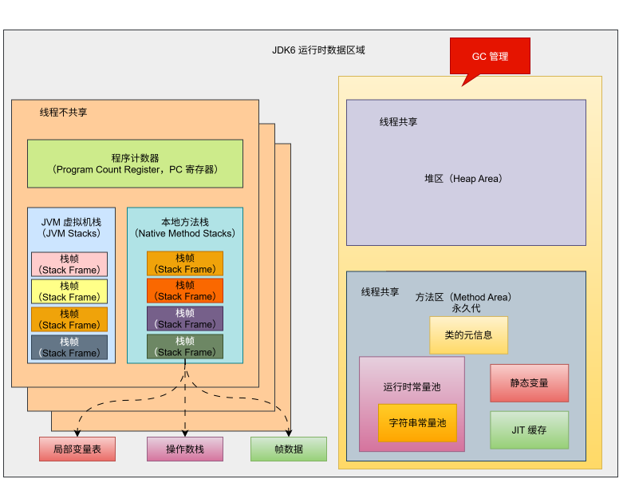
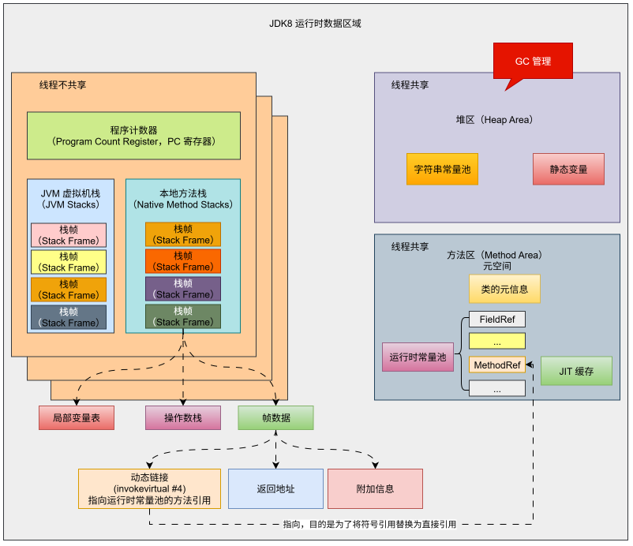
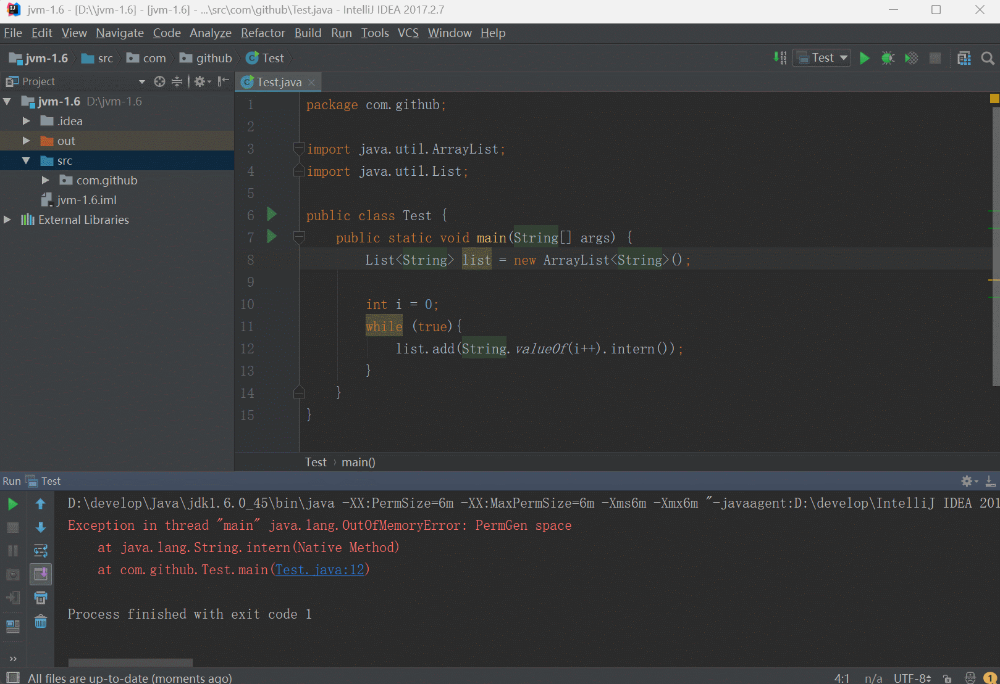

# 第一章：String Table（⭐）

## 1.1 String 的基本特性

### 1.1.1 字符串常量池（String Pool）

* ① 字面量方式创建的字符串（`"hello"`）会被存储在`字符串常量池` 中（位于堆内存中的特殊区域）。

> [!NOTE]
>
> 字符串常量池中不会存储相同内容的字符串，如下所示：
>
> * String 的字符串常量池（String Pool）是一个固定大小的 Hashtable，默认值大小长度是 1009 。如果放进 String Pool 的 String 非常多，就会造成 Hash 冲突严重，从而导致链表会很长，而链表长了后造成的直接影响就是当调用 String.intern() 时性能会大幅度下降。
> * 使用 `-XX:StringTableSize` 可以设置 StringTable 的长度。
> * 在 JDK6 中的 StringTable 是固定的，就是 1009 的长度；所以，如果字符串常量池（String Pool）中的字符串过多就会导致性能下降很快，并且 StringTableSize 参数设置没有要求。
> * 在 JDK7 中的 StringTable 的长度默认值是 60013，并且 StringTableSize 参数设置没有要求。
> * 在 JDK8 中的 StringTable 的长度默认值是 60013，并且 StringTableSize 参数设置中 1009 是最小值。 

* ② 如果常量池中已存在相同内容的字符串，则直接复用，避免重复创建。
* ③ 使用 `new String("...")` 会强制在堆中创建新对象，即使内容相同。

> [!NOTE]
>
>  `==` 比较引用， `.equals()` 比较内容。 


* 示例：

```java
package com.github;
public class Test {
    public static void main(String[] args) {
        
        String a = "hello";
        String b = "hello";
        System.out.println(a == b); // true（引用相同）
        
    }
}
```


* 示例：

```java
package com.github;
public class Test {
    public static void main(String[] args) {
        
        String c = new String("hello");
        String d = new String("hello");
        System.out.println(c == d); // false（堆中不同对象）
        
    }
}
```

### 1.1.2 不可变性（Immutability）

* ① 一旦创建，`String` 对象的内容就无法被修改。
* ② 所有看似“修改”字符串的方法（ `substring()`、`concat()`、`replace()` 等）实际上都会返回一个新的 `String` 对象，而原对象保持不变。
* ③ 不可变性带来了线程安全、缓存哈希值、字符串池优化等优势。


* 示例：

```java
package com.github;
public class Test {
    public static void main(String[] args) {
        
        String s1 = "hello";
        String s2 = s1.concat(" world"); // 创建新对象
        System.out.println(s1 == s2); // false
        System.out.println(s1); // 输出: hello（未变）
        
    }
}
```

### 1.1.3 final 类

* ① `String` 类被声明为 `final`，不能被继承。
* ② 其内部的字符数组 `value`（在 Java 8 及之前是 `char[]`，Java 9+ 改为 `byte[]` + 编码标识）也是 `final` 的，确保内容不可变。

> [!NOTE]
>
> - Java 9 引入了 `Compact Strings` 优化：
>   - 若字符串仅包含 Latin-1 字符（0~255），使用 `byte[]` 存储，每个字符占 1 字节。
>   - 否则使用 UTF-16 编码（每个字符占 2 字节）。
> - 减少了内存占用，提升性能。

* ③ `String` 实现了 `CharSequence` 接口，因此可以与 `StringBuilder`、`StringBuffer` 等统一处理。


* 示例：

```java
public final class String // [!code highlight]
    implements java.io.Serializable, Comparable<String>, CharSequence { // [!code highlight]
    
    private final char value[]; // [!code highlight]
    
    ...
        
}
```

### 1.1.4 重写了 Object 的关键方法

* ① `equals(Object obj)`：按内容比较字符串是否相等。
* ② `hashCode()`：基于字符串内容计算哈希值，用于哈希表，如： `HashMap`。
* ③ `toString()`：返回字符串本身。


* 示例：

```java
package com.github;
public class Test {
    public static void main(String[] args) {
        
        String s1 = new String("abc");
        String s2 = new String("abc");
        System.out.println(s1.equals(s2)); // true（内容相同）
        
    }
}
```

## 1.2 String 的内存分配

### 1.2.1 概述

* 在 Java 语言中有 8 种基本数据类型和 String 类型（特殊的引用数据类型） 。这些类型为了使它们在运行过程中速度更快、更节省内存，都提供了一种`常量池`的概念。
* `常量池`就类似于 Java 系统级别提供的缓存；8 种基本数据类型的常量池都是系统协调的，而 `String 类型的常量池就比较特殊`。
* 对于 String 类型的常量池，主要有两种使用方法，如下所示：
  * ① 直接使用双引号声明出来的 String 对象会直接存储在常量池中，即：字面量声明的方式。
  * ② 如果不是双引号声明出来的 String 对象，可以使用 String 提供的 intern() 方法，让其存储到常量池中。

### 1.2.2 字符串常量池的迁移

* 在 JDK6 之前，`字符串常量池`是存放在`永久代`中。



* 在 JDK7 中，Hotspot 将`字符串常量池`的位置由方法区（永久代）迁移到了`堆`中。


* 在 JDK8 ，永久代被元空间取代；但是，`字符串常量池`还是在`堆`中。



### 1.2.3 验证

* 需求：不断的向字符串常量池中添加字符串，看报错信息，以观察字符串常量池的位置。

> [!NOTE]
>
> ::: details 点我查看 准备代码
>
> ```java
> package com.github;
> 
> import java.util.ArrayList;
> import java.util.List;
> 
> public class Test {
>     public static void main(String[] args) {
>         List<String> list = new ArrayList<String>();
> 
>         int i = 0;
>         while (true){
>             list.add(String.valueOf(i++).intern());
>         }
>     }
> }
> ```
>
> :::


* 示例：JDK6

::: code-group

```bash
-XX:PermSize=6m -XX:MaxPermSize=6m -Xms6m -Xmx6m 
```

```md:img [cmd 控制台]

```

:::


* 示例：JDK8

::: code-group

```bash
-XX:MetaspaceSize=32m -XX:MaxMetaspaceSize=32m -Xms6m -Xmx6m 
```

```md:img [cmd 控制台]

```

:::

## 1.3 String 的基本操作

* Java 语言规范中要求完全相同的字符串字面量，应该包含同样的 Unicode 字符序列（包含同一份码点序列的常量），并且必须是指向同一个 String 类实例。


* 示例：

::: code-group

```java [Test.java]
package com.github;

public class Test {
    public static void main(String[] args) {
        System.out.println("1"); // 2109
        System.out.println("2"); // 2111
        System.out.println("3");
        System.out.println("4");
        System.out.println("5");
        System.out.println("6");
        System.out.println("7");
        System.out.println("8");
        System.out.println("9");
        System.out.println("10"); // 2119

        System.out.println("1"); // 2120
        System.out.println("2"); // 2120
        System.out.println("3");
        System.out.println("4");
        System.out.println("5");
        System.out.println("6");
        System.out.println("7");
        System.out.println("8");
        System.out.println("9");
        System.out.println("10"); // 2120
    }
}
```

```md:img [cmd 控制台]

```

:::

## 1.4 字符串的拼接操作


## 1.5 intern() 的使用


## 1.6 String Table 的垃圾回收


# 第二章：执行引擎

